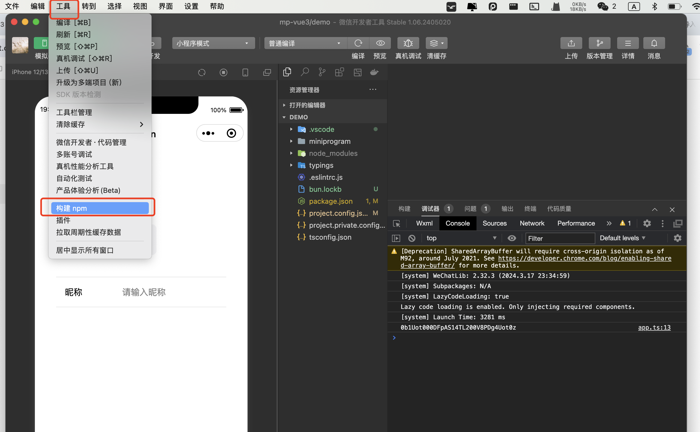

# MP-VUE3

* 组合api好处就是方便集中处理逻辑，而微信小程序还是`options`方式，有什么方式可以直接使用`vue3`响应数据吗？首选是使用`uni-app` 直接选择 `vue3` 模版，使用过的都知道有2大通病
  * 性能问题
  * 体积问题
* 如何解决这个问题，我们可以在`ts`中拦截处理，通过响应式数据拦截处理，而`wxml` 和 `wxss` 保持一致
  * 体积很小
  * 通过`组合api` 集中处理逻辑

## 如何安装

```sh
bun add @52css/mp-vue3
```

## 通过`npm`构建



## 如何写页面

* `index.ts`

```ts
import { ref, definePage } from "@52css/mp-vue3";

// 通过definePage，定义响应式页面
definePage(() => {
  const count = ref(0);
  const onIncrease = () => {
    count.value++;
  };

  return {
    // 返回响应式数据
    count,
    // 返回事件
    onIncrease,
  };
});

```

* `index.wxml`

```html
<view>count: {{count}}</view>
<button bind:tap="onIncrease">增加</button>
```

* 效果


## 如何写组件

* `index.ts`

```ts
import { defineComponent } from "@52css/mp-vue3";

defineComponent({
  // 属性名称和 vue 一致
  props: {
    // 定义单类型
    name: String,
    // 定义对象，通过default控制默认值
    border: {
      type: Boolean,
      default: false,
    },
  },
  setup(props, { emit }) {
    // props 即 小程序 this.properties
    // emit 即 小程序 this.triggerEvent

    // 需要返回响应式数据、方法
    return {};
  },
});

```

* `index.wxml`

```html
<view>hello {{name}}</view>
```

* `效果`


## API

### 页面

* definePage 定义页面
* getCurrentPage 获取当前页面

### 页码生命周期

* onLoad => setup
* onShow
* onReady
* onHide
* onUnload
* onRouteDone
* onPullDownRefresh
* onReachBottom
* onPageScroll
* onAddToFavorites
* onShareAppMessage
* onShareTimeline
* onResize
* onTabItemTap
* onSaveExitState

### 组件

* defineComponent 定义组件
* getCurrentInstance 获取当前示例
* useObserver 监控属性变化(props和data)

### 组件生命周期

* attached => setup
* ready
* moved
* detached
* error

### Core

* computed
* reactive
* ref
* readonly

### Utilities

* unref
* proxyRefs
* isRef
* toRef
* toValue
* toRefs
* isProxy
* isReactive
* isReadonly
* isShallow

### Advanced

* customRef
* triggerRef
* shallowRef
* shallowReactive
* shallowReadonly
* markRaw
* toRaw

### Effect

* effect
* stop
* ReactiveEffect

### Effect scope

* effectScope
* EffectScope
* getCurrentScope
* onScopeDispose

### Watch

* watch
* watchEffect
* watchPostEffect
* watchSyncEffect